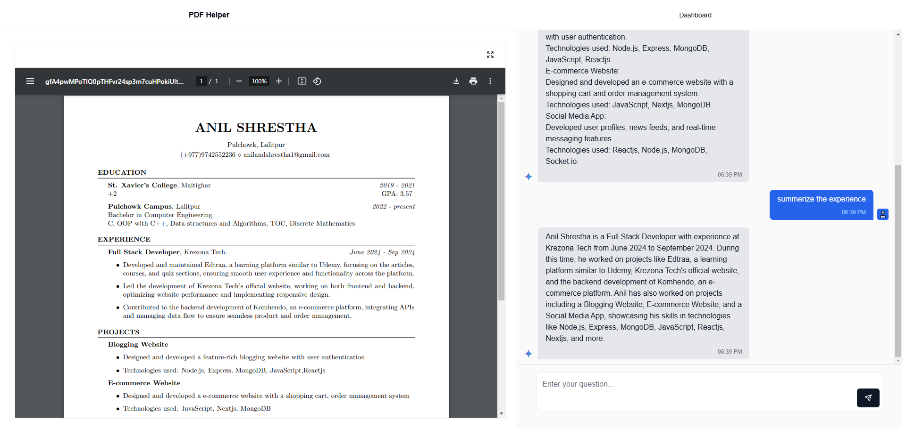

# PDF Helper

This is a powerful application that allows you to chat with your PDF documents using AI. Upload any PDF and start asking questions to get instant answers based on the document's content.



## Features

- **PDF Upload**: Easily upload PDF documents through a drag-and-drop interface
- **AI-Powered Chat**: Ask questions about your uploaded documents and get accurate responses
- **Document Management**: View, organize, and delete your uploaded PDFs
- **PDF Viewer**: Built-in PDF viewer with fullscreen capability
- **User Authentication**: Secure login with email/password, Google, or GitHub
- **Responsive Design**: Works seamlessly across desktop and mobile devices

## Technology Stack

### Frontend
- Next.js 14
- React 18
- React Query for data fetching
- TailwindCSS for styling
- React PDF for document rendering
- React Markdown for formatting chat messages

### Backend
- Next.js API Routes
- Prisma ORM with MongoDB
- NextAuth.js for authentication
- LangChain for document processing and AI interactions
- Pinecone for vector storage

### AI Integration
- OpenAI API for text generation
- PDF parsing and text extraction

## Getting Started

### Prerequisites

- Node.js 18+ installed
- MongoDB database (local or cloud)
- OpenAI API key
- Pinecone API key
- (Optional) Google and GitHub OAuth credentials

### Installation

1. Clone the repository:
    ```bash
    git clone https://github.com/anilstha1/pdf-helper.git
    ```

2. Install dependencies:
    ```bash
    npm install
    ```

3. Create a `.env` file in the root directory with the following variables:
    ```
    # Database
    DATABASE_URL="your-mongodb-connection-string"

    # Authentication
    NEXTAUTH_SECRET="your-secret-key"
    NEXTAUTH_URL="http://localhost:3000"

    # OAuth Providers (optional)
    GOOGLE_CLIENT_ID="your-google-client-id"
    GOOGLE_CLIENT_SECRET="your-google-client-secret"
    GITHUB_ID="your-github-client-id"
    GITHUB_SECRET="your-github-client-secret"

    # OpenAI
    OPENAI_API_KEY="your-openai-api-key"

    # Pinecone
    PINECONE_API_KEY="your-pinecone-api-key"
    PINECONE_ENVIRONMENT="your-pinecone-environment"
    PINECONE_INDEX="your-pinecone-index"

    # UploadThing
    UPLOADTHING_SECRET="your-uploadthing-secret"
    UPLOADTHING_APP_ID="your-uploadthing-app-id"
    ```

4. Set up the database:
    ```bash
    npx prisma generate
    ```

5. Run the development server:
    ```bash
    npm run dev
    ```

6. Open [http://localhost:3000](http://localhost:3000) in your browser to see the application.